# Shooting Range VR

## Unity VR Project (with SteamVR)

The project was developed on the topic: training in handling weapons and special equipment in virtual reality. This is my bachelor's degree graduation work.

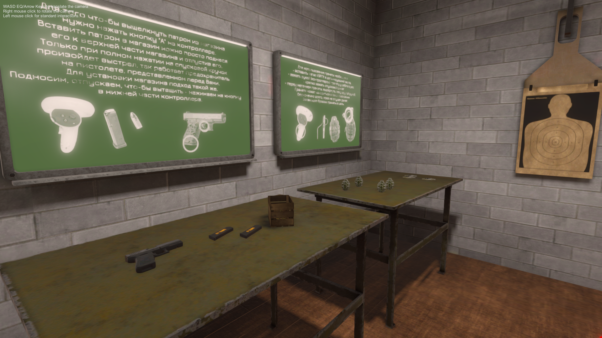

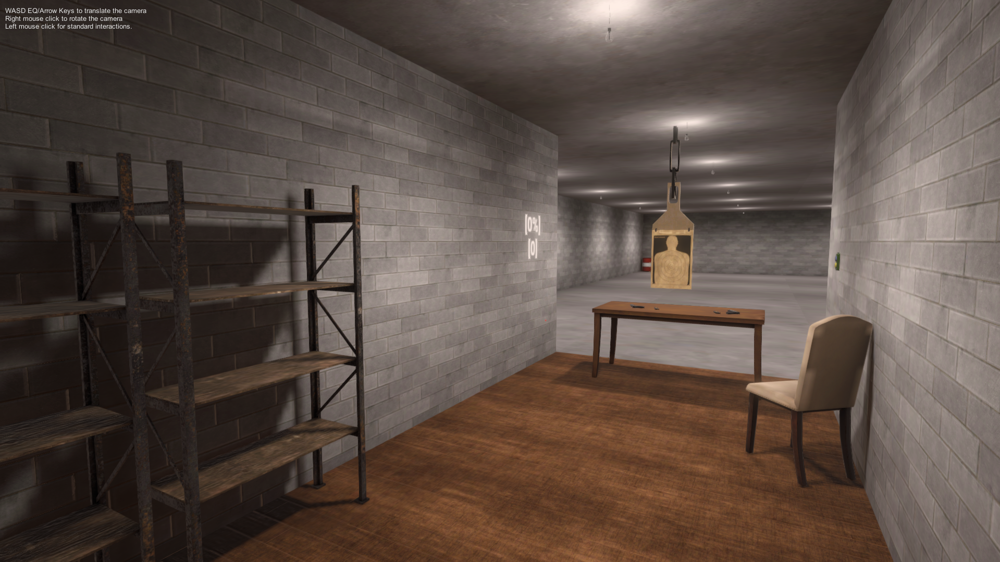

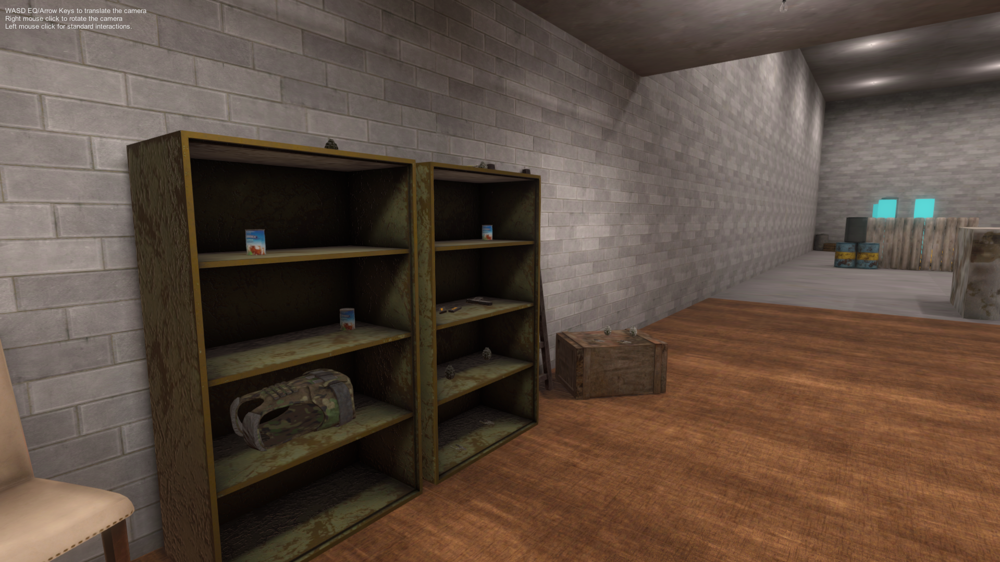

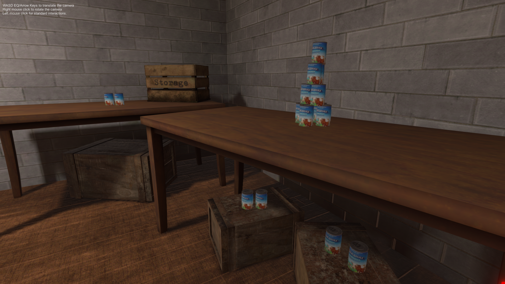

## Gameplay Mechanics

### Glock 17

---

Below with preview and descriptions provided information about core mechanics, like shooting, reloading, disarming magazines of handgun Glock 17.
Glock 17 with 9mm caliber have 4 different types of ammo, with different start velocity, force on impact and more.

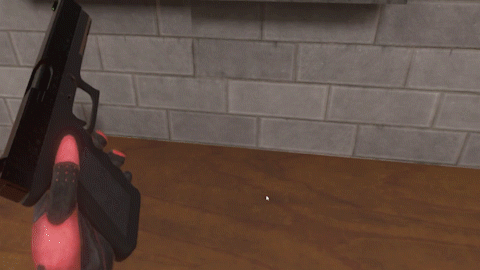

### Grenade F-1

---

Russian anti-personnel fragmentation defensive grenade with fuse type of "UZRGM", you can drag the ring on fuse, you can hold lever. Fuse can explode independently of "main" detonate thing. But it will little explosion with a small amount of fragments and low speed (a bit of smoke of course). With fuse inserted in nade it become a real grenade F-1, just hold lever, drag ring and throw in whatever direction you want. Explosion will heavely affect other phycical object around.

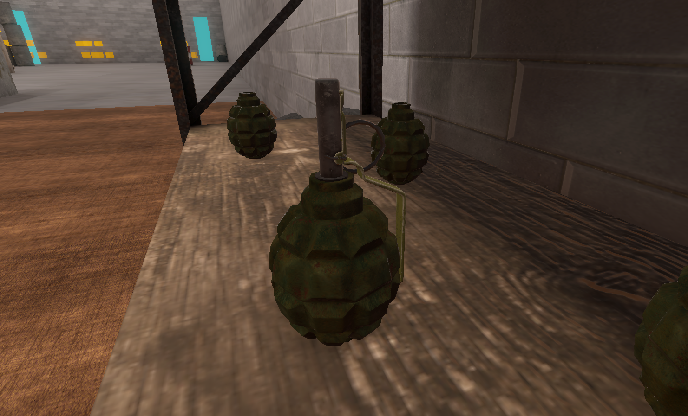

### Equipment

---

In game presented two types of equipment: body armor and military helmet. Helmet will protect your head and face (if visor is down) against fragments and small calibers. In game you have only one type of helmet - Altyn. Very protective helmet, but it dampens noises a lot outside the helmet, so after putting it on in the game you will hear sounds worse.
Body armor saves you from grenade fragments and absorbs and dissipates energy of bullets on impact. Current body armor in game - Gzhel. The Gzhel assault bulletproof vest is designed for assault units of the Ministry of Internal Affairs and other law enforcement agencies. Lightweight and excellent protection against direct hits thanks to ceramic plates.

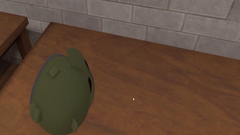

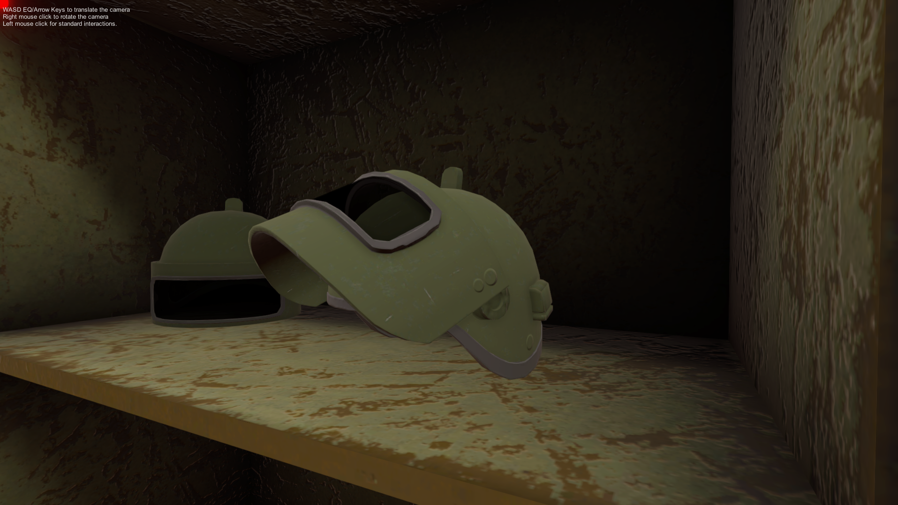

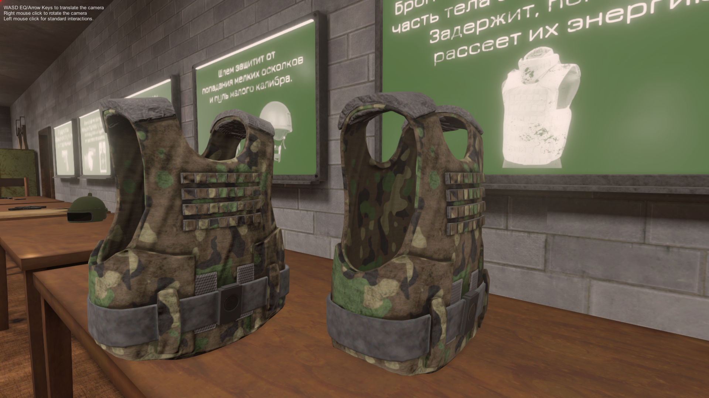

### Target Practice

---

You can practice your skills in shooting on targets in "Guns Range", with remote control you can set distance for human-like target, on your left, on wall you can see average accuracy and amount of bullets fired on target.

### Knife & Canned Food

---

In additional, with knife "Anti-Terror" you can try to open russian canned meat and taste it!

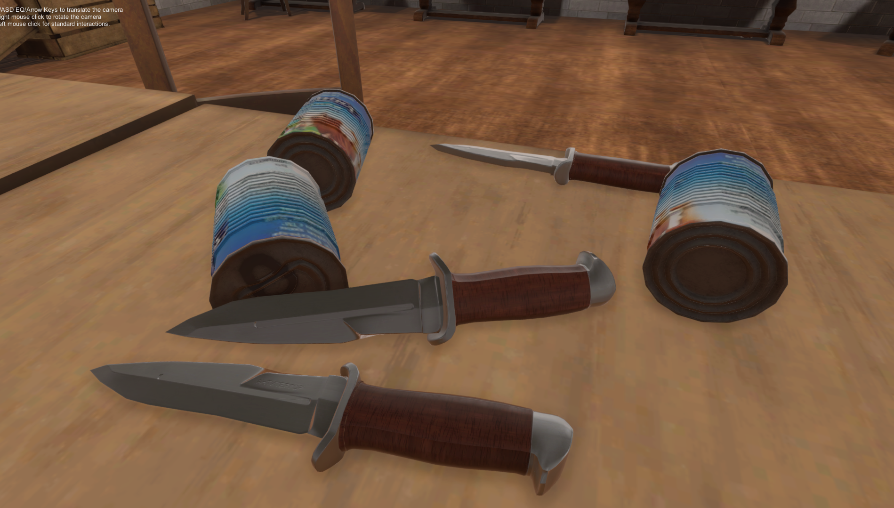

## Controllers Bindings

You will need to configure your bindings to play this game. For Oculus Quest 2 you can find it by this link. ([Oculus Bindings](/ControllerBindings/shootings_range_vr_oculus_quest_2.json))
You need to allocate two buttons with simple "Button" specialization. For example on Oculus it will be "A", "B" and "X" & "Y". More information on my controllers bindings on image below.

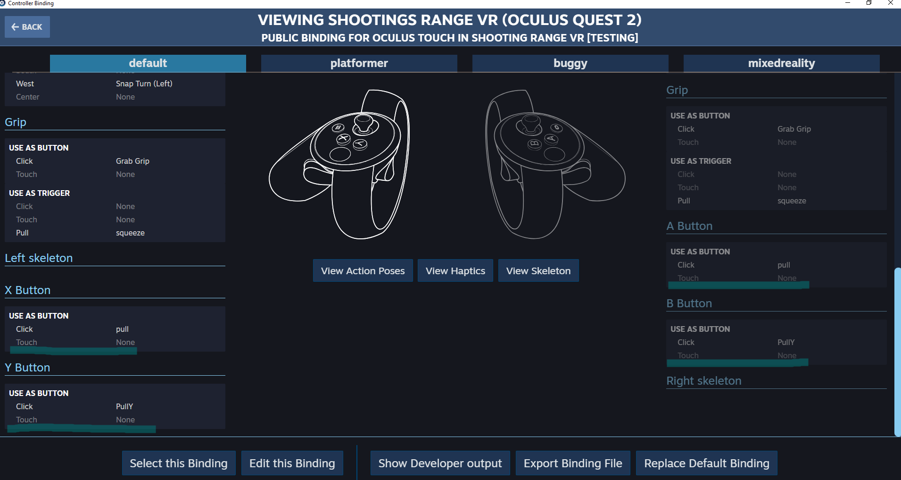

## Link to latest release of game

Shooting Range VR Beta v1.0:

---

- Link - [Shooting Range VR](https://github.com/kaayran/ShootingRangeVR/releases/)
- [Download](https://github.com/kaayran/ShootingRangeVR/releases/download/release/ShootingRangeVR.7z)
